  <a href="https://github.com/khushboocodes">
    <picture>
      <source media="(prefers-color-scheme: dark)" srcset="dark.svg">
      
    </picture>
  </a>

    

  <!-- Arcade Jet Contribution Heatmap -->
  

 

### ⚡ About Me

> **AI Engineer & Full-Stack Developer** building intelligent, production-grade applications that turn raw data into high-impact systems. Focused on AI agent workflows, multilingual document intelligence, SaaS architecture, and resilient distributed services.

- 🔭 **Currently Building**: Scalable AI-native platforms solving real-world citizen & business problems.
- 💡 **Core Expertise**: LLM integrations (Gemini / OpenAI), TypeScript/React web apps, Python backend microservices, and automated document processing pipelines.
- 📍 **Based in**: Gwalior, Madhya Pradesh, India
- 📬 **Reach out**: [khushboocodes@gmail.com](mailto:khushboocodes@gmail.com)

---

### 🚀 Featured Projects

<table>
  <tr>
    <td width="50%" valign="top">
      <h3><a href="https://github.com/khushboocodes/Nivaran">🇮🇳 Nivaran</a></h3>
      
<b>Citizen Grievance & National Demand Intelligence</b>

      
Empowers Members of Parliament and administrators with AI-driven, multilingual feedback intelligence to prioritize high-impact regional development projects.

      

        
        
        
        
        
      

    </td>
    <td width="50%" valign="top">
      <h3><a href="https://github.com/khushboocodes/Recoup">💸 Recoup</a></h3>
      
<b>Autonomous Revenue Recovery Engine</b>

      
Identifies merchant revenue about to churn, diagnoses root causes, executes the most cost-effective intervention, and mathematically verifies recovered capital against control groups.

      

        
        
        
      

    </td>
  </tr>
  <tr>
    <td width="50%" valign="top">
      <h3><a href="https://github.com/khushboocodes/StartupOps">⚡ StartupOps</a></h3>
      
<b>Desktop-First SaaS Platform for Early Startups</b>

      
Production-ready operations management dashboard designed to consolidate early-stage team metrics, roadmaps, and execution tracking in one unified interface.

      

        
        
        
      

    </td>
    <td width="50%" valign="top">
      <h3><a href="https://github.com/khushboocodes/InvoiceFlow">📄 InvoiceFlow</a></h3>
      
<b>AI Document Intelligence & Financial Extraction</b>

      
High-accuracy document extraction system that automatically converts unstructured tractor loan invoices and quotation documents into structured tabular data.

      

        
        
        
      

    </td>
  </tr>
</table>

---

### 🛠️ Tech Stack (Grounded in Repository Activity)

| Category | Technologies |
| :--- | :--- |
| **Languages** | `TypeScript` (49.0%) · `Python` (29.7%) · `JavaScript` (7.4%) · `HTML/CSS` (13.6%) · `SQL` |
| **Frontend** | `React 18` · `Next.js` · `Tailwind CSS v4` · `Vite` · `Radix UI` · `Responsive UI` |
| **Backend & APIs** | `Node.js` · `FastAPI` · `Hono` · `Express.js` · `RESTful APIs` |
| **Databases & ORM** | `PostgreSQL` · `Prisma ORM` · `MongoDB` · `Supabase` |
| **AI & Automation** | `Google Gemini API` · `Document AI & OCR` · `Autonomous Interventions` · `Prompt Eng` |
| **DevOps & Cloud** | `Docker` · `Git & GitHub Actions` · `Vercel` · `Vite` · `Postman` |

---

### 📊 GitHub Activity & Insights

  
   
  

---

### 🌐 Connect With Me

